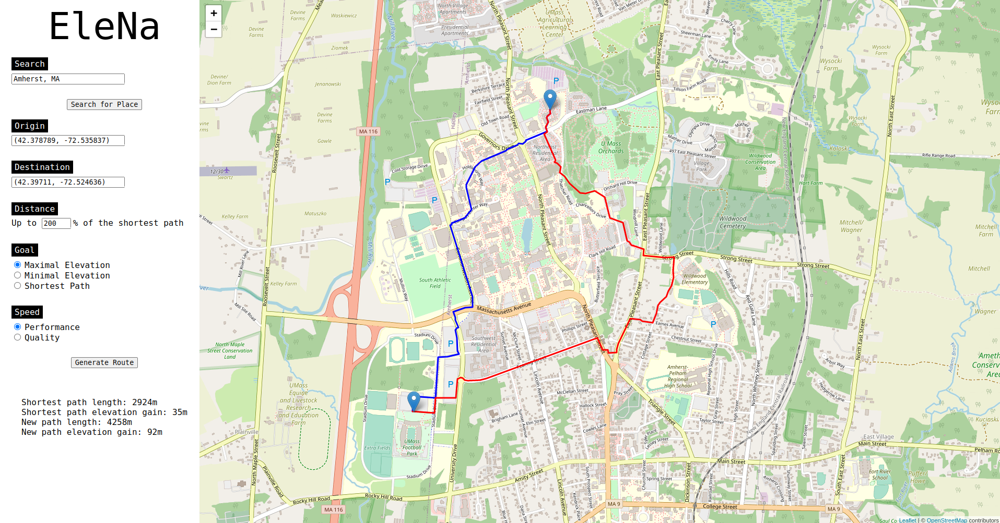

# EleNa (CS 520)
Elevation Navigation Web Application



### Contributors

Aidan Greenslade, Dylan Finkbeiner, Alexander Hulbert, Akash Munjial, Matthew Xu

## Installation And Usage

1. Install required dependencies
```Python
pip3 install -r requirements.txt
```

2. Run flask server
```Python
python3 app.py
```

3. Access the app in your browser from `http://localhost:5000`

----

To run for production, use the following command instead:
```Python
python3 app.py --prod
```

## Documentation

To compile the documentation using Sphinx, run the following command from the top-level directory:
```
make docs
```
This will create a symbolic link in the top-level directory called `index.html` linking to the homepage of the documentation. Open it in your browser to view the docs.

You may need to clean up the existing compiled docs (especially if the source code has been modified) using the following:
```
make clean-docs
```

## Testing

To run the tests using pytest, run the following command from the top-level directory:
```
pytest
```
This will run all the tests in the test folder and produce the results. If your machine complains that it cannot find the pytest command, try this command instead:
```
python3 -m pytest
```
